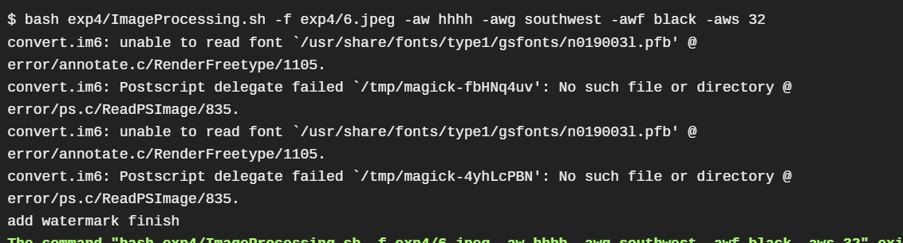

# 实验报告四

## 实验内容
* 任务一：用bash编写一个图片批处理脚本，实现以下功能：
    * 支持命令行参数方式使用不同功能
    * 支持对指定目录下所有支持格式的图片文件进行批处理
    * 支持以下常见图片批处理功能的单独使用或组合使用
        * 支持对jpeg格式图片进行图片质量压缩
        * 支持对jpeg/png/svg格式图片在保持原始宽高比的前提下压缩分辨率
        * 支持对图片批量添加自定义文本水印
        * 支持批量重命名（统一添加文件名前缀或后缀，不影响原始文件扩展名）
        * 支持将png/svg图片统一转换为jpg格式图片
    - 

* 任务二：用bash编写一个文本批处理脚本，对以下附件分别进行批量处理完成相应的数据统计任务：
    * [2014世界杯运动员数据](exp/chap0x04/worldcupplayerinfo.tsv)
        * 统计不同年龄区间范围（20岁以下、[20-30]、30岁以上）的球员**数量**、**百分比**
        * 统计不同场上位置的球员**数量**、**百分比**
        * 名字最长的球员是谁？名字最短的球员是谁？
        * 年龄最大的球员是谁？年龄最小的球员是谁？

* 任务三：用bash编写一个文本批处理脚本，对以下附件分别进行批量处理完成相应的数据统计任务：
    * [Web服务器访问日志](exp/chap0x04/web_log.tsv.7z)
        * 统计访问来源主机TOP 100和分别对应出现的总次数
        * 统计访问来源主机TOP 100 IP和分别对应出现的总次数
        * 统计最频繁被访问的URL TOP 100
        * 统计不同响应状态码的出现次数和对应百分比
        * 分别统计不同4XX状态码对应的TOP 10 URL和对应出现的总次数
        * 给定URL输出TOP 100访问来源主机

## 实验结果
- [travis链接](https://travis-ci.org/CUCCS/linux-2019-FLYFLY-H)

## 实验问题
- 上传到traivs之后，任务一中对图片加水印那个问题中，提示 
  
  - 解决办法：在`.traivs.yml`中添加语句`sudo apt-get install ghostscript`

## 参考资料
- [2015-linux-public-songyawen](https://github.com/CUCCS/2015-linux-public-songyawen/tree/master/exp4)
- [2017-linux-public-FitzBC](https://github.com/CUCCS/linux/tree/master/2017-1/FitzBC/%E5%AE%9E%E9%AA%8C4)