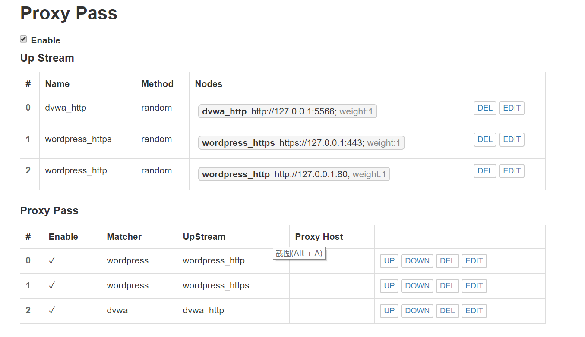
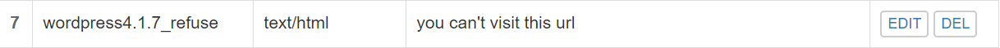

# 实验报告五

## 实验环境
- Ubuntu-18.04-server虚拟机，作为服务器，安装有verynginx,nginx,Wordpress,DVWA,ip=192.168.133.3
- Win10宿主机进行远程访问,ip=192.168.133.1

## 拓扑结构


## 实验要求
### 基本要求
* 在一台主机（虚拟机）上同时配置Nginx和VeryNginx
    * VeryNginx作为本次实验的Web App的反向代理服务器和WAF
    * PHP-FPM进程的反向代理配置在nginx服务器上，VeryNginx服务器不直接配置Web站点服务
* 使用Wordpress搭建的站点对外提供访问的地址为： https://wp.sec.cuc.edu.cn 和 http://wp.sec.cuc.edu.cn
* 使用Damn Vulnerable Web Application (DVWA)搭建的站点对外提供访问的地址为： http://dvwa.sec.cuc.edu.cn

### 安全加固要求
* 使用IP地址方式均无法访问上述任意站点，并向访客展示自定义的**友好错误提示信息页面-1**
* Damn Vulnerable Web Application (DVWA)只允许白名单上的访客来源IP，其他来源的IP访问均向访客展示自定义的**友好错误提示信息页面-2**
* 在不升级Wordpress版本的情况下，通过定制VeryNginx的访问控制策略规则，**热**修复[WordPress \< 4.7.1 - Username Enumeration](https://www.exploit-db.com/exploits/41497/)
* 通过配置VeryNginx的Filter规则实现对Damn Vulnerable Web Application (DVWA)的SQL注入实验在低安全等级条件下进行防护

### VeryNginx配置要求
* VeryNginx的Web管理页面仅允许白名单上的访客来源IP，其他来源的IP访问均向访客展示自定义的**友好错误提示信息页面-3**
* 通过定制VeryNginx的访问控制策略规则实现：
    * 限制DVWA站点的单IP访问速率为每秒请求数 < 50
    * 限制Wordpress站点的单IP访问速率为每秒请求数 < 20
    * 超过访问频率限制的请求直接返回自定义**错误提示信息页面-4**
    * 禁止curl访问

## 实验过程
### 基本要求
- **安装并配置VeryNginx**
  - 参照[官方文档](https://github.com/alexazhou/VeryNginx/blob/master/readme_zh.md)安装VeryNginx
  ```bash 
  # 克隆该仓库
  git clone https://github.com/alexazhou/VeryNginx.git
  
  # 进入仓库目录
  cd VeryNginx
  
  # 尝试安装
  python3 install.py install # 失败
 
  # 根据提示信息安装所需组件
  sudo apt install openssl libssl1.0-dev #一开始直接安装libssl-dev失败
  sudo apt install libpcre3 libpcre3-dev
  sudo apt install zlib1g-dev
  sudo apt install build-essential
  
  sudo python3 install.py install # 成功
  ```
  - 修改配置文件/opt/verynginx/openresty/nginx/conf/nginx.conf 第二行`user nginx`改为`user www-data`(这是nginx默认用户)
  - 启动VeryNginx `sudo /opt/verynginx/openresty/nginx/sbin/nginx`
  - 在本地Chrome浏览器访问http://192.168.133.3/verynginx/index.html<br>
- **安装nginx**
  - 安装nginx：`apt install nginx`
- **安装wordpress，并配置ssl**
  - 参考[How To Install WordPress with LEMP on Ubuntu 18.04](https://www.digitalocean.com/community/tutorials/how-to-install-wordpress-with-lemp-on-ubuntu-18-04#step-1-%E2%80%94-creating-a-mysql-database-and-user-for-wordpress)进行安装
    ```bash
    # 安装mysql
    sudo apt install mysql-server

    sudo mysql -u root -p
  
    mysql> CREATE DATABASE wordpress DEFAULT CHARACTER SET utf8 COLLATE utf8_unicode_ci;
  
    mysql> GRANT ALL ON wordpress.* TO 'wordpressuser'@'localhost' IDENTIFIED BY 'password';
  
    mysql> FLUSH PRIVILEGES;
  
    mysql> exit;
    
    sudo systemctl restart mysql
  
    # 安装PHP拓展
    sudo apt install php-curl php-gd php-intl php-mbstring php-soap php-xml php-xmlrpc php-zip
  
    sudo apt install php7.2-fpm
  
    sudo systemctl restart php7.2-fpm
  
    # 下载安装WordPress
    cd /tmp
    curl -LO https://wordpress.org/latest.tar.gz
    tar xzvf latest.tar.gz
    # 移动到根目录中
    sudo cp -a /tmp/wordpress/. /var/www/html/wordpress
    ```
  - 使用之前配置ssl的方法生成wordpress的私钥和证书
    `sudo openssl req -x509 -nodes -days 365 -newkey rsa:2048 -keyout /etc/ssl/private/wp-selfsigned.key -out /etc/ssl/certs/wp-selfsigned.crt`
  - 修改nginx配置文件`/etc/nginx/sites-enabled/default`
    ```bash
    server {
        listen 80;  # 使用80端口监听
        root /var/www/html/wordpress;
        index index.php index.php index.nginx-debian.php; # php优先
        server_name wp.sec.cuc.edu.cn;
        location / {
                try_files $uri $uri/ =404;
        }
         location ~ \.php$ {
                include snippets/fastcgi-php.conf;
                fastcgi_pass unix:/run/php/php7.2-fpm.sock;
        }
    }
    server {
        listen 443;
        server_name wp.sec.cuc.edu.cn;
        root /var/www/html/wordpress;
        index index.php index.php index.nginx-debian.php;
        ssl on;
        ssl_certificate /etc/ssl/certs/wp-selfsigned.crt;
        ssl_certificate_key /etc/ssl/private/wp-selfsigned.key;
        location ~ \.php$ {
                include snippets/fastcgi-php.conf;
                fastcgi_pass unix:/run/php/php7.2-fpm.sock;
        }
    }
    ```
  - 安装php-mysql：`sudo apt install php-mysql`
  - 在/var/www/html/wordpress/wp-config.php中填写之前创建的mysql的数据库名wordpress,用户名wordpressuser，密码password
  - 在本地hosts文件添加映射
  - 访问https://wd.sec.cuc.edu.cn/wordpress/readme.html，下载安装wordpress，注册用户然后登录
  - 参考之前[师姐的实验报告](https://github.com/CUCCS/linux/blob/master/2017-1/TJY/webserver/webserver.md)，将数据库前两行option_value的值改为https://wp.sec.cuc.edu.cn,因为wordpress每次都会使用数据库的值来重定向url<br>
  
  - 登录后的页面<br>
  
- **安装dvwa**
  - 安装过程[参考教程](https://kifarunix.com/how-to-setup-damn-vulnerable-web-app-lab-on-ubuntu-18-04-server/)
    ```baash
     sudo git clone https://github.com/ethicalhack3r/DVWA /tmp/DVWA
     sudo mv /tmp/DVWA /var/www/html
     
     sudo cp /var/www/html/DVWA/config/config.inc.php.dist /var/www/html/DVWA/config/config.inc.php
     
     sudo mysql -u root -p
  
     mysql> CREATE DATABASE dvwa DEFAULT CHARACTER SET utf8 COLLATE utf8_unicode_ci;
  
     mysql> GRANT ALL ON dvwa.* TO 'dvwauser'@'localhost' IDENTIFIED BY 'password';
  
     mysql> FLUSH PRIVILEGES;
  
     mysql> exit;
    
     sudo systemctl restart mysql
     
     sudo vim /var/www/html/DVWA/config/config.inc.php
        # 文件做一下修改
        allow_url_include = on - 允许远程文件包含（RFI）
        allow_url_fopen = on - 允许远程文件包含（RFI）
        safe_mode = off - （如果PHP <= v5.4）允许SQL注入（SQLi）(没有找到，手动添加)
        magic_quotes_gpc = off - （如果PHP <= v5.4）允许SQL注入（SQLi）(没有找到，手动添加)
        display_errors = off
    
    chown -R www-data.www-data /var/www/html/dvwa
    ```
  - 修改nginx配置文件，添加以下内容
    ```bash
    server {
        listen 5566; 
        root /var/www/html/dvwa;
        index index.php index.php index.nginx-debian.php;
        server_name dvwa.sec.cuc.edu.cn;
        location / {
                try_files $uri $uri/ =404;
        }
        location ~ \.php$ {
                include snippets/fastcgi-php.conf;
                fastcgi_pass unix:/run/php/php7.2-fpm.sock;
        } 
    }
    
    sudo systemctl restart nginx
    ```
  - 在本地hosts文件添加映射
  - 本地浏览器访问http://dvwa.sec.cuc.edu.cn，登录dvwa<br>
    
- **配置verynginx反向代理**
  - 修改verynginx和nginx的配置文件<br>
    [verynginx配置文件](nginx.conf)<br>
    [nginx配置文件](default)<br>
  - 登录verynginx进行相关设置
    - Basic_Matcher<br>
    <br>
    
    - Backend_Proxy Pass<br>
    

### 安全加固要求
- 使用IP地址方式均无法访问上述任意站点，并向访客展示自定义的**友好错误提示信息页面-1**
  - Basic_Matcher<br>
    
  - Basic_Response<br>
    
  - Custom Action_Filter<br>
    
  - 结果展示<Br>
    
- DVWA只允许白名单上的访客来源IP，其他来源的IP访问均向访客展示自定义的**友好错误提示信息页面-2**
  - Basic_Matcher<br>
    
  - Basic_Response<br>
    
  - Custom Action_Filter<br>
    
  - 之前实验把宿主机的ip禁掉了，通过修改/opt/verynginx/verynginx/configs/config.json文件来进行修改配置
- 在不升级Wordpress版本的情况下，通过定制VeryNginx的访问控制策略规则，**热**修复WordPress \< 4.7.1 - Username Enumeration
  - 漏洞描述：访问/wp-json/wp/v2/users/可以获取wordpress用户信息的json数据
  - Basic_Matcher<br>
    
  - Basic_Response<br>
    
  - Custom Action_Filter<Br>
    
  - 结果展示<Br>
    
- 通过配置VeryNginx的Filter规则实现对Damn Vulnerable Web Application (DVWA)的SQL注入实验在低安全等级条件下进行防护
  - Basic_Matcher<br>
    
  - Basic_Response<br>
    
  - Custom Action_Filter<bR>
    
  - 结果展示<br>
    

### VeryNginx配置要求
* VeryNginx的Web管理页面仅允许白名单上的访客来源IP，其他来源的IP访问均向访客展示自定义的**友好错误提示信息页面-3**
  - Basic_Matcher<br>
    
  - Basic_Response<br>
    
  - Custom Action_Filter<br>
    
  - 避免宿主机被禁掉，就不展示了。
* 通过定制VeryNginx的访问控制策略规则实现：
    * 限制DVWA站点的单IP访问速率为每秒请求数 < 50<br>
      
    * 限制Wordpress站点的单IP访问速率为每秒请求数 < 20<br>
      
    * 禁止curl访问<Br>
      <Br>
      
      