## 无人值守Linux安装镜像制作

#### 实验内容
- 配置无人值守安装iso并在Virtualbox中完成自动化安装。
- Virtualbox安装完Ubuntu之后新添加的网卡实现系统开机自动启用和自动获取IP
- 使用sftp在虚拟机和宿主机之间传输文件

#### 实验环境
- 宿主机：Windows10
- 虚拟机：Ubuntu-18.04-1-server
   - 双网卡：NAT，host-only

#### 实验思路
- 有人值守安装Ubuntu-18.04-server版虚拟机
- 为了后续通过复制粘贴来修改配置文件，配置[SSH](https://zh.wikipedia.org/wiki/Secure_Shell)实现在宿主机远程登陆虚拟机
  - 设置host-only网卡，让虚拟机和宿主机在同一网段内
  - 使用putty配置SSH免密登陆
- 创建定制版无人值守iso镜像文件
  - 下载Ubuntu-16.04-server.iso并克隆其内容到创建的虚拟机工作目录中
  - 在工作目录中对其进行修改定制
  - 重新生成iso文件，并使用fstp传到宿主机上


#### 实验过程
- 有人值守安装Ubuntu-18.04-server版本虚拟机，配置双网卡，一块NAT一块host-only
- 配置host-only网卡信息
  - 使用命令`sudo vim /etc/netplan/01-netcfg.yaml`打开配置文件，追加如下两行内容，增加一块host-only网卡
    ```
     enp0s8:
     dhcp4: yes
    ```
  - 使用命令`sudo netplan apply`使修改生效
  - 使用命令`ifconfig`查看网卡，确实添加了一块网卡<br>
  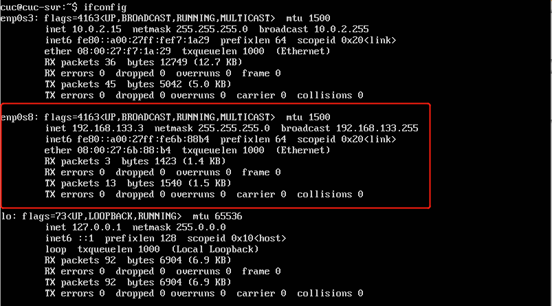
- 使用putty配置ssh
  - 在安装Ubuntu-18.04-server的过程中安装了ssh server,我们再确认一下ssh是否正常工作<Br>
  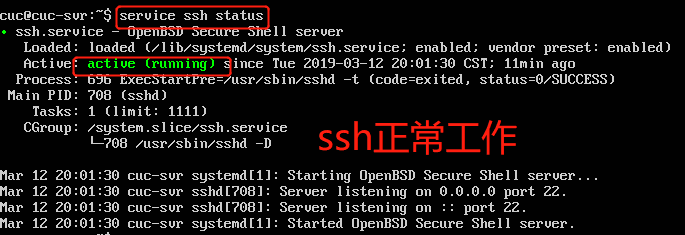
  - 在宿主机上安装putty
  - 打开putty.exe，在host name里输入host-only网卡的IP地址，就可以在宿主机上登录Ubuntu虚拟机
  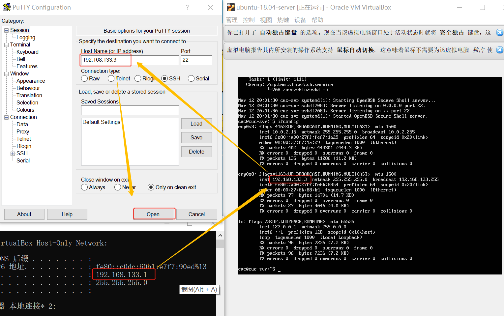
  - 接下来设置免密登录。先用puttygen.exe生成密钥。将生成的公钥粘贴到~/.ssh/authorized_keys文件中(要先创建)，私钥保存到本地
  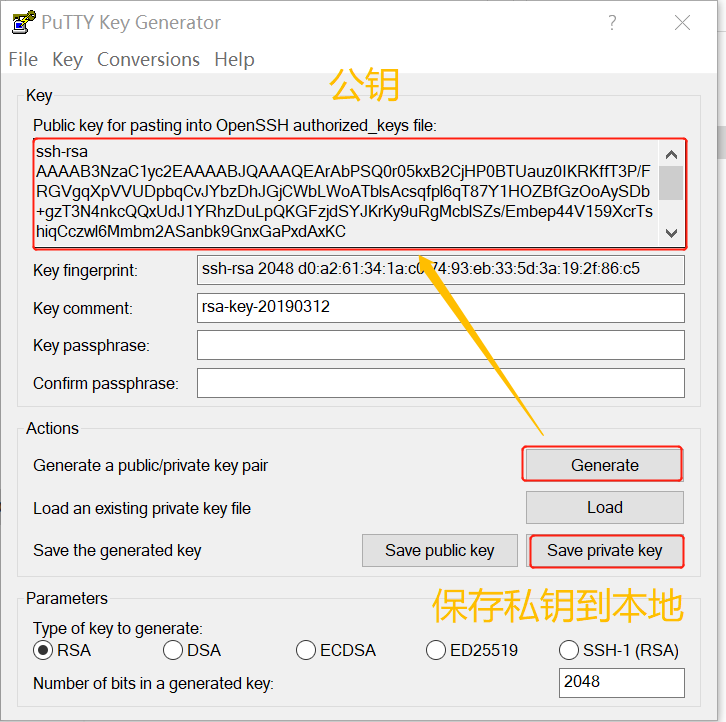
  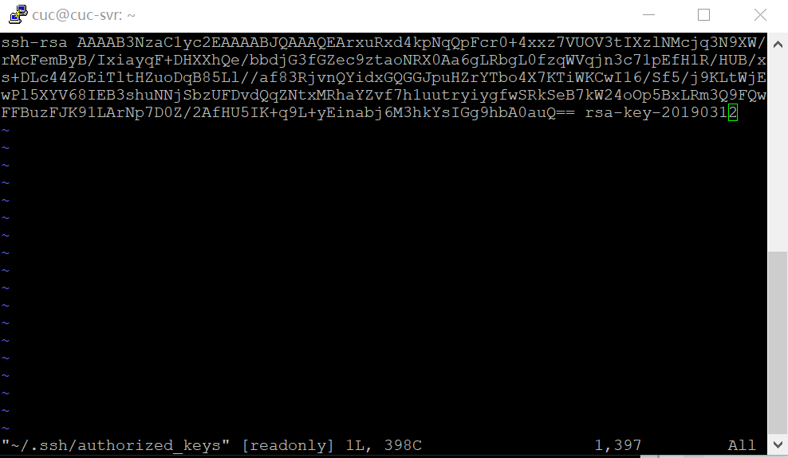
- 创建定制版无人值守iso镜像文件
  - 在Ubuntu18.04虚拟机上进行如下操作
  
    ```
    # 在当前用户目录下创建一个用于挂载iso镜像文件的目录
    mkdir loopdir
    
    # 下载Ubuntu-16.04.1-server-amd64.iso
    wget http://sec.cuc.edu.cn/ftp/iso/ubuntu-16.04.1-server-amd64.iso
    
    # 挂载iso镜像文件到该目录
    sudo mount -o loop ubuntu-16.04.1-server-amd64.iso loopdir

    # 创建一个工作目录用于克隆光盘内容
    mkdir cd
 
    # 同步光盘内容到目标工作目录
    # 一定要注意loopdir后的这个/，cd后面不能有/
    rsync -av loopdir/ cd

    # 卸载iso镜像
    sudo umount loopdir

    # 进入目标工作目录，之后在虚拟机里的操作都在该目录下进行
    cd cd/

    # 编辑Ubuntu安装引导界面增加一个新菜单项入口
    vim isolinux/txt.cfg
      # 在txt.cfg中添加以下内容
      label autoinstall
         menu label ^Auto Install Ubuntu Server
         kernel /install/vmlinuz
      append  file=/cdrom/preseed/ubuntu-server-autoinstall.seed debian-installer/locale=en_US console-setup/layoutcode=us keyboard-configuration/layoutcode=us console-setup/ask_detect=false localechooser/translation/warn-light=true localechooser/translation/warn-severe=true initrd=/install/initrd.gz root=/dev/ram rw quiet
    ```
    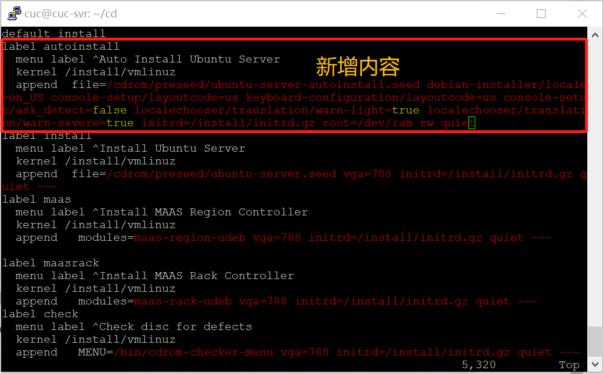
  - 在宿主机上通过fstp将下载在宿主机上定制好的ubuntu-server-autoinstall.seed文件传入虚拟机(使用git bash)
    
  ```
  # stfp连接虚拟机
  stfp cuc@192.168.133.3 # 会提示输入密码
  
  put  put D: / 大三下/Linux/ubuntu-server-autoinstall.seed /home/cuc/cd/preseed

  ```
  
  - 回到宿主机，打开isolinux/isolinux.cfg文件增加内容timeout 10（可选，否则需要手动按下ENTER启动安装界面）

  ```
  # 打开文件
  vim isolinux/isolinux.cfg
  
  # 将timeout=0改为timeout=10
  ```
  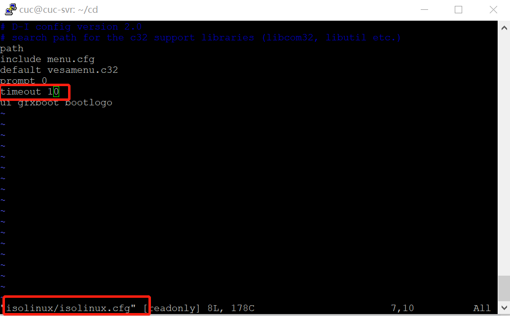
  - 重新生成md5sum.txt
    - 执行指令：`cd ~/cd && find . -type f -print0 | xargs -0 md5sum > md5sum.txt`
    - 第一次执行时会报错，通过`sudo chmod 777 md5sum.txt`修改文件权限来解决此问题
  - 打开shell脚本，添加内容保存退出，然后执行shell
  
    ```
    # 打开脚本呢
    vim shell
    
    # 添加以下内容
    # 封闭改动后的目录到.iso
    IMAGE=custom.iso
    BUILD=~/cd/

    mkisofs -r -V "Custom Ubuntu Install CD" \
               -cache-inodes \
               -J -l -b isolinux/isolinux.bin \
               -c isolinux/boot.cat -no-emul-boot \
               -boot-load-size 4 -boot-info-table \
               -o $IMAGE $BUILD

    
    # 执行shell脚本。注意第一次尝试时会提醒没有mkisoft命令，要先下载genisoimage(下载之前记得apt update)
    sudo bash shell

    ```
  - 将最后的custom.iso通过fstp传到宿主机，在git bash里执行
    ` get /home/cuc/cd/custom.iso D:/`
  - 使用custom.iso新装一台Ubuntu-16.04-server版本虚拟机

#### 问题思考
- 修改定制好的Ubuntu-server-autoinstall.seed文件和官方示例文件进行对比，使用[在线文本对比工具](https://www.diffchecker.com/diff)来对比二者的改动
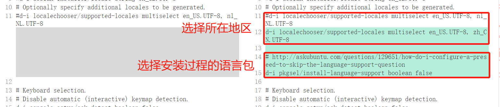
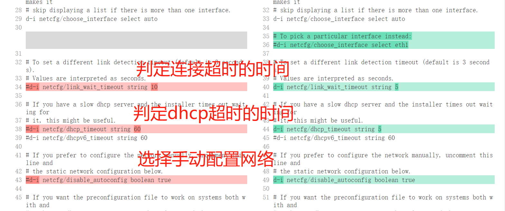
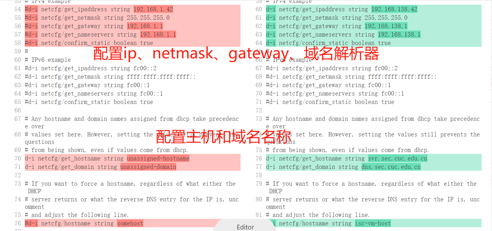
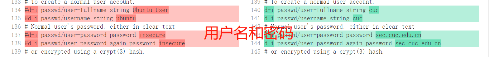
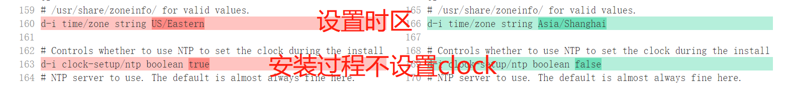
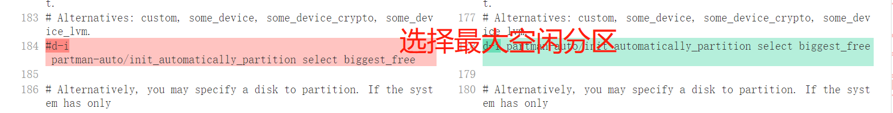
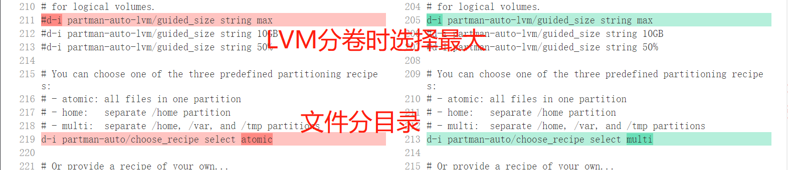
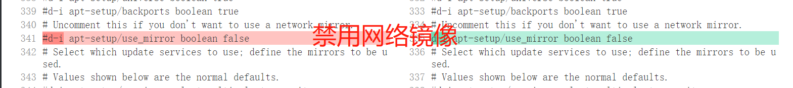
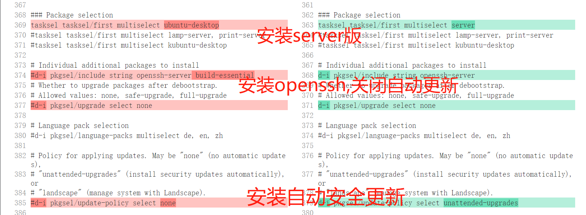
#### 参考资料
- [SSH](https://zh.wikipedia.org/wiki/Secure_Shell)
- [vim](https://www.cnblogs.com/freyr/p/3648749.html)
- [putty配置ssh免密登录](https://blog.csdn.net/zhaoxixc/article/details/82314957)
- [Linux实验一作业提示](https://sec.cuc.edu.cn/huangwei/course/LinuxSysAdmin/chap0x01.exp.md.html#/6/6)
- [CUCCS/linux-2019-luyj/Linux_exp0x01](https://github.com/CUCCS/linux-2019-luyj/blob/bcc1a93af56faa9b8cea2144efc890b358f229cb/Linux_exp0x01/%E5%AE%9E%E9%AA%8C%E6%8A%A5%E5%91%8A_01.md)