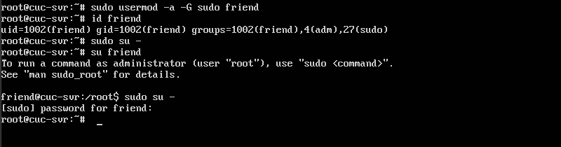
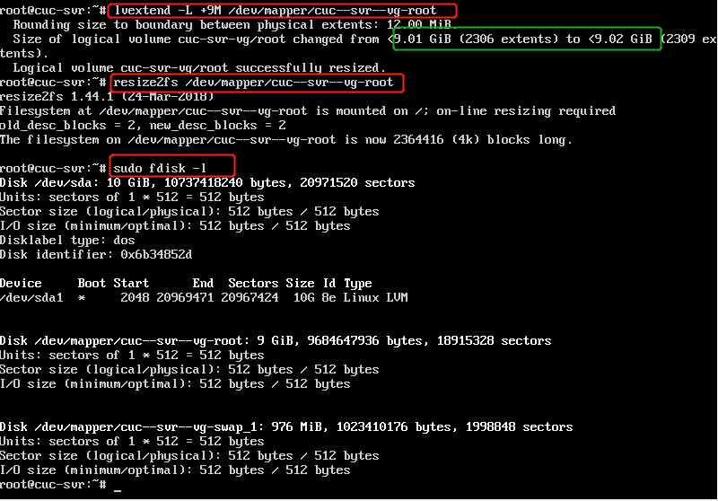

# Sytemd入门实验

## 实验内容
- [Systemd 入门教程：命令篇 by 阮一峰的网络日志](http://www.ruanyifeng.com/blog/2016/03/systemd-tutorial-commands.html)
- [Systemd 入门教程：命令篇 by 阮一峰的网络日志](http://www.ruanyifeng.com/blog/2016/03/systemd-tutorial-part-two.html)
  - 参照第2章作业的要求，完整实验操作过程通过asciinema进行录像并上传

## 实验过程
### 命令行篇录像链接
- [systemd_part1 系统管理](https://asciinema.org/a/236007)<br>
- [systemd_part2 Unit](https://asciinema.org/a/236009)<br>
- [systemd_part3 Unit配置文件](https://asciinema.org/a/236078)<br>
- [systemd_part4 Target](https://asciinema.org/a/236082
)<Br>
- [systemd_part5 日志管理](https://asciinema.org/a/236085
)<br>

### 实战篇录像链接
- [systemd_part6](https://asciinema.org/a/236099)<br>

### 自查清单
- 如何添加一个用户并使其具备sudo执行程序的权限？
  ``` bash
  su 
  adduser friend # 添加一个friend用户
  
  sudo usermod -a -G sudo friend # 将friend用户加到sudo组里面
  ```
  
- 如何将一个用户(username)添加到一个用户组(usergroup)？ 
  ```bash
  sudo usermod -a -G usergroup username
  ```
- 如何查看当前系统的分区表和文件系统详细信息？
  - 查看当前系统分区表：`sudo fdisk -l`
  - 查看文件系统详细信息：`cat /etc/fstab`
- 如何实现开机自动挂载Virtualbox的共享目录分区？
  - 在/etc/fstab文件中追加`sharing /mnt/share vboxsf defaults 0 0` 
    - 此方法在Ubuntu16.04-desktop环境下失败，开机后系统进入了命令行模式且共享文件夹没有自动挂载
    - 网上的解释是：因为系统调用fstab的时候，Virtualbox的共享目录的模块还没有加载，所以每次加载都会失败
  - 在/etc/rc.local中追加`mount -t vboxsf myshare /mnt/share`
    - 成功
- 基于LVM（逻辑分卷管理）的分区如何实现动态扩容和缩减容量？
    ```bash
    sudo lvextend -L +5g foo/bar # 对foo卷组所对应的bar逻辑卷添加5GB大小
    sudo lvextend -L -5g foo/bar # 对foo卷组所对应的bar逻辑卷减少5GB大小
    sudo resize2fs /dev/foo/bar
    ```
    
- 如何通过systemd设置实现在网络连通时运行一个指定脚本，在网络断开时运行另一个脚本？
  - 假设网络连通时运行脚本A，断开时运行脚本B
  - 将与NetworkManager.service配置文件的Service区块的ExecStartPost和ExecStopPost两个字段进行修改：
  ```bash
    ExecStartPost = A
    ExecStopPost = B
  ```
- 如何通过systemd设置实现一个脚本在任何情况下被杀死之后会立即重新启动？实现**杀不死**？
  - 将其配置文件的Service区块的Restart字段值设为always，表示不管是什么退出原因总是重启


### 实验问题
- 在对LVM缩减容量时，提示“size cannot be negative”,暂时还没有解决。